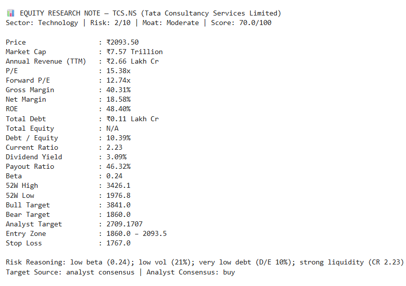
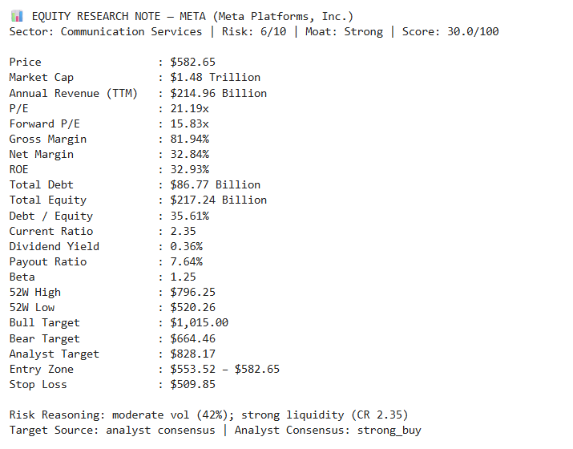
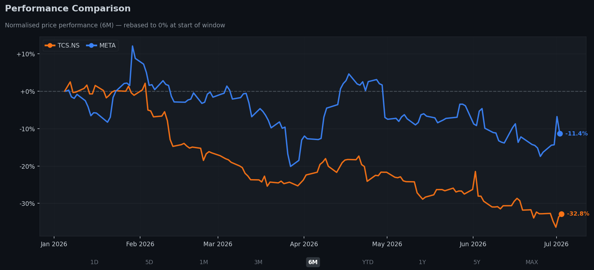
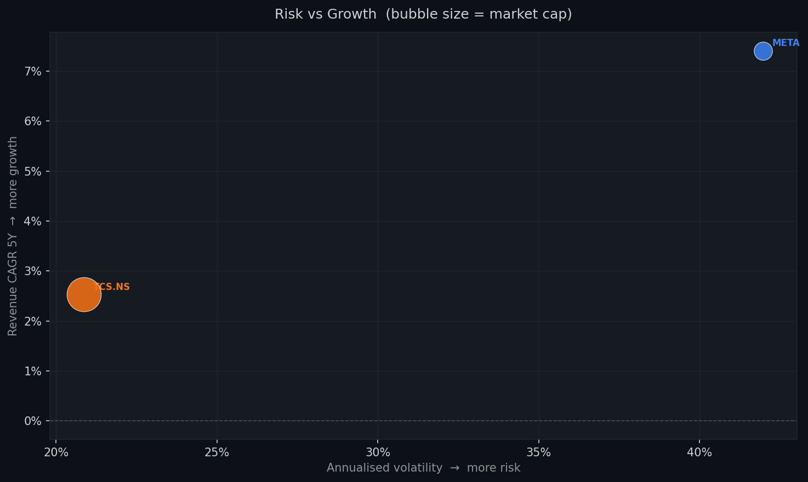
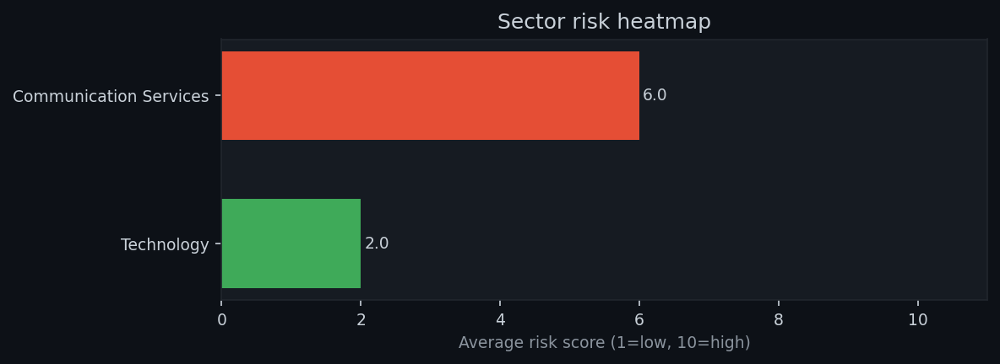
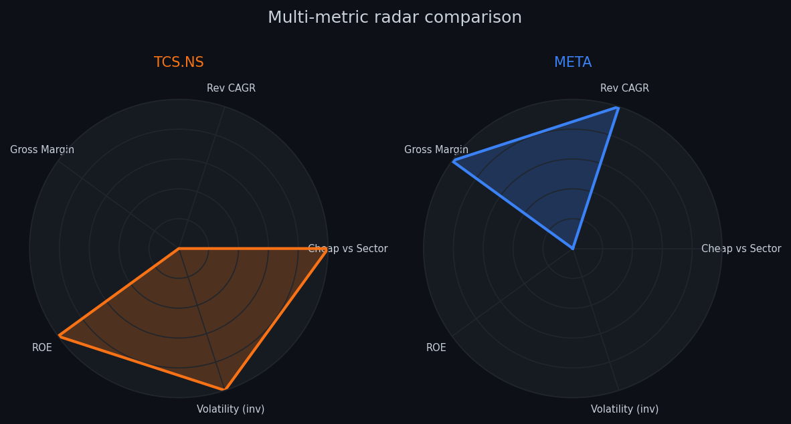
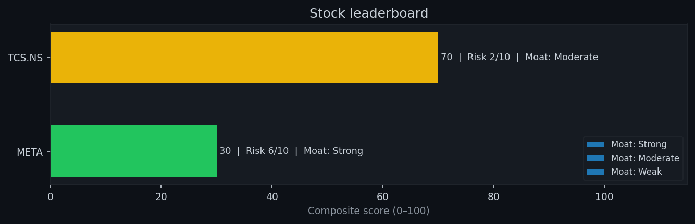

# 📈 AI Stock Research Screener

An AI-powered stock research and screening tool for US and Indian equities. This project fetches live financial data, computes key investment metrics, screens stocks based on customizable criteria, generates professional equity research reports using Google's Gemini API, and exports results to Excel.

---

## 🚀 Features

- 🌎 Supports US and Indian (NSE) stocks
- 📊 Live market data using Yahoo Finance
- 📈 Revenue CAGR (5 Years)
- 💰 Gross Margin, Net Margin, ROE
- 🏦 Debt-to-Equity & Current Ratio
- 📉 Annualized Volatility
- 🛡 Risk Score (1–10)
- 🏰 Quantitative Moat Rating
- 💵 Dividend Analysis
- 🎯 Bull & Bear Price Targets
- 🤖 AI-generated Equity Research Reports (Google Gemini)
- 📄 Excel Export
- 📊 Data Visualization

---

## 📂 Project Structure

```
AI-Stock-Research-Screener/
│
├── notebooks/
│   └── stock_screener.ipynb
│
├── data/
│   ├── screened_stocks.xlsx
│   └── stock_analysis.xlsx
│
├── images/
│   ├── leaderboard.png
│   ├── performance_comparison.png
│   ├── radar_chart.png
│   ├── risk_return_scatter.png
│   └── sector_heatmap.png
│
├── .env.example
├── .gitignore
├── README.MD
└── .requirements.txt
```

---

## ⚙ Installation

Clone the repository

```bash
git clone https://github.com/YOUR_USERNAME/AI-Stock-Research-Screener.git

cd AI-Stock-Research-Screener
```

Install dependencies

```bash
pip install -r requirements.txt
```

Launch Jupyter Notebook

```bash
jupyter notebook
```

Open

```
notebooks/stock_screener.ipynb
```

---

## ▶ Usage

Enter stock tickers when prompted.

Example

```
AAPL,MSFT,NVDA,TSLA,RELIANCE.NS,TCS.NS
```

The notebook automatically

- Downloads financial data
- Calculates investment metrics
- Screens stocks
- Generates AI research reports
- Exports Excel reports

---

## AI Equity Research Report

<h2>Sample Equity Research Reports</h2>

<p align="center">
  
  
</p>

## Performance Comparison



## Risk vs Return



## Sector Heatmap



## Radar Chart



## Leaderboard



---

## 🛠 Technologies

- Python
- Pandas
- NumPy
- yfinance
- GROQ API
- OpenPyXL
- Matplotlib